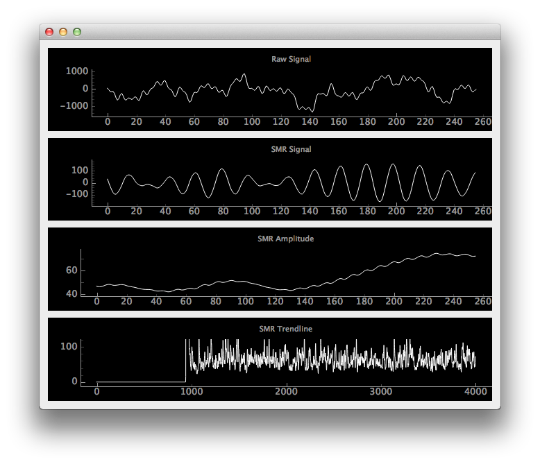

Recently i have been working a lot on my open source neurofeedback framework, OpenNFB: http://github.com/strfry/OpenNFB
It''s not quite ready for a big announcement to the public, but today i used it to do some simple SMR Training.



The idea behind this project is to develop a simple Domain Specific Language that offers different filter blocks, similar to 
classic Neurofeedback software (like BioExplorer), and combine them with a few lines of Python code.
The code of the above screenshot looks like this:

```python

class SMRFlow(object):
	
def init(self, context):
Cz = context.get_channel(Channel 1, color=red, label=Raw with 50/60 Hz Noise)

Cz = DCBlock(Cz).ac

self.OSC1 = Oscilloscope(Raw Signal, channels=[BandPass(0.0, 30.0, input=Cz).output])
		
SMR = BandPass(12, 15, input=Cz, order=6).output
self.OSC2 = Oscilloscope(SMR Signal, channels=[SMR])

SMR_amplitude = Averager(Amplitude(SMR).output).output

self.OSC3 = Oscilloscope(SMR Amplitude, channels=[SMR_amplitude])

SMR_trend = Trendline(SMR_amplitude).output

self.OSC4 = Oscilloscope(SMR Trendline, channels=[SMR_trend])

self.bb = BinauralBeat(volume=SMR_amplitude)

def widget(self):
w = QtGui.QWidget()
layout = QtGui.QGridLayout()
w.setLayout(layout)

layout.addWidget(self.OSC1.widget(), 0, 0)
layout.addWidget(self.OSC2.widget(), 1, 0)
layout.addWidget(self.OSC3.widget(), 2, 0)
layout.addWidget(self.OSC4.widget(), 3, 0)

return w
```

