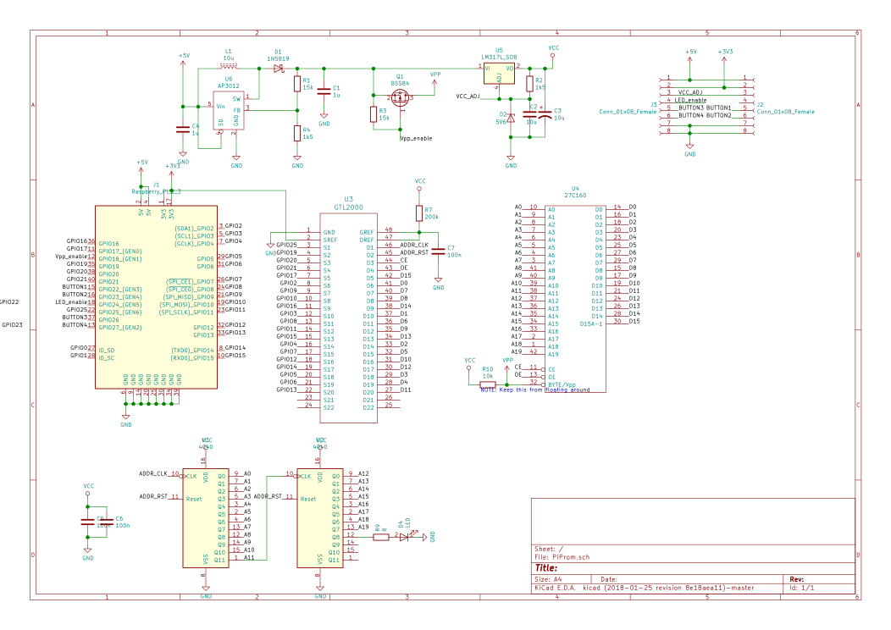

---
date:	2018-02-22 01:31:00 +0100
title:	UV EPROM Pi Project
#categories: project blog
layout: post
---

**Technical Background**

Before the age of Flash Memory and EEPROM (Electrically-Erasable Programmable Read-Only Memory),
handling solid-state memory was available in 2 variants: One-time-programmable, and erasable by UV light.
Both work in a similar way, but the latter one has a window of quartz glass that allows photons of sufficient energy, e.g. UV-C light, to pass and kick the electrons back out of their containment.

**Goal**

A friend brought up the idea of artistically examining this process.
The biggest available UV-erasable EPROM (M27C160, 8 MBit EPROM by ST Microelectronics) is attached to a Raspberry Pi, which uses it to store and image and continuously display it during the erasure process, under sunlight or the influence of a special UV-C LED.

We also want to see if something interesting can be discovered about the internal layout of the memory cells, by selectively masking section of the UV window.

Reading this [Application Note AN620](https://www.digchip.com/datasheets/parts/datasheet/000/AN620.php) brought some 
insights:
EPROMs vary their behaviour depending on their supply voltage. A partly programmed cell might look as programmed (Bit \'0\'), 
but flips it\'s value at a higher voltage (to Bit \'1\', unprogrammed). This implies that EPROM cell actually stores an 
analog 
value, with is converted into a binary digit by a comparator circuitry inside the IC, whose reference voltage is derived from the supply voltage Vcc.
The recommended programming algorithm is not applying a fixed programming time, but continuously applies programming pulses, and reads back the written value.
To program the memory in the most reliable way, the supply voltage during readout should be near the maximum (about 7V).
When the EPROM is programmed in-circuit, while other components are connected to the same supply voltage, these other components might not like the increased voltage (many 5V rated ICs specify a absolute maximum rating of 5.5V supply voltage).
So the ST EPROMs advertise a patented feature: While the 12V Vpp programming voltage is applies, and WE (write-enable) is not active, an internal higher supply current is derived from Vpp to enable reliable readouts.

That being said, this brought me to the idea make the EPROM supply voltage adjustable (by a potentiometer), to get a better, interactive insight into this analog process.

The varying voltage level is translated to the Raspberry Pi\'s 3.3V level GPIOs with a GTL2000 level shifter.

**Design**

**The current design is currently in production, and not recommended for own manufacture**

The chip i designed consists of these components:
* Step-Up converter for programming voltage, switchable by a P-channel MOSFET
* 16 bit data pins connected to consecutively numbered GPIO pins of the Raspberry Pi through GTL2000 level shifter
* LM317 linear regulator to derive supply current from Vpp
* Socket Headers for mounting the UV-LED driver, and control elements (buttons for programming, erasure and voltage potentiometer)

For the address lines, i borrowed a neat trick from a EEPROM programmer schematic i found only (can\'t remember the source, 
sorry):
Since we are reading and writing the EEPROM always in a linear manner (from beginning to end), there is no need to randomly select addresses.
Thus, the 15 available address bits are reduced to 2 connections to the RPi: Address CLK and RESET. These connect to cascaded 74HC4040 ripple counters, which count upwards with each rising (falling?) CLK edge, going through all the possible addresses eventually.

**Light source**

For more information about the nature of the UV light required to erase EPROMs:
http://donklipstein.com/uvbulb.html#ep

**gpio mapping**

To achieve the best real-timey experience, the GPIOs should be controlled by native code.
In order to reduce the necessary instructions per address, the data line ordering matches the native GPIO numbering.
To respect the RPi Hat specification, we can't use the GPIOs 0 and 1, since they are reserved for a Hat identification EEPROM.
So D0 is mapped to GPIO2, D1 to GPIO, up to D15 matching GPIO17.
Hopefully this means that the memory content of an address can be readed with a single 32 bit and a bitshift instruction,
and additionally 2 toggles of the CLK line (GPIO25)

Register Programming example:
https://elinux.org/RPi_GPIO_Code_Samples#Direct_register_access

https://www.raspberrypi.org/app/uploads/2012/02/BCM2835-ARM-Peripherals.pdf
Page 89: GPIOs accessible in 32 bit reads, organized in banks 0 and 1

https://elinux.org/RPi_BCM2835_GPIOs

performance comparison of different approaches:
http://codeandlife.com/2012/07/03/benchmarking-raspberry-pi-gpio-speed/comment-page-1/

**mechanicals**

These are some calculations to see if the PiProm can be fitted into the drawer of a cheap UV eraser from eBay.
These plans are superseded by the discovery of UV-C LEDs, that can be neatly fitted ontop the EPROM.

ZIF socket: 3M 242-1281-00-0602J 21€
total height = 11.9 + 11.6 mm = 23.5mm
6.73 + 11.6 = 18.43

cheap china uv eraser: height = 48mm, tray height >= 16mm

